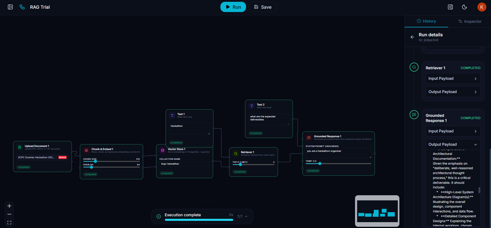
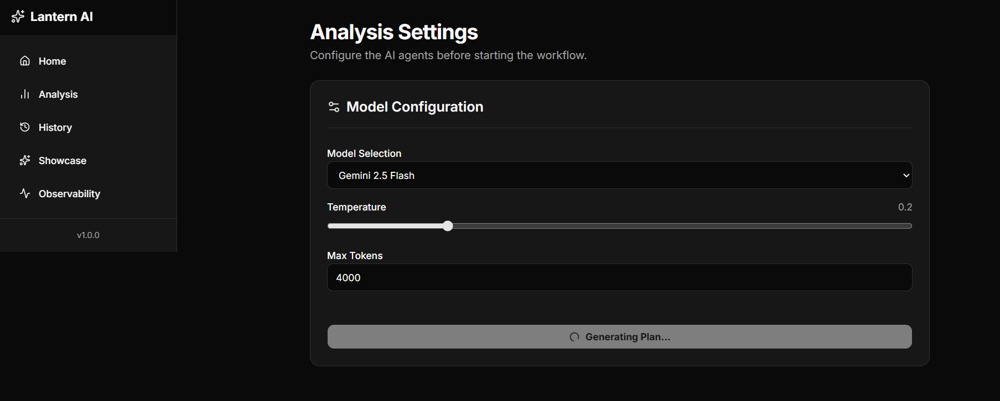
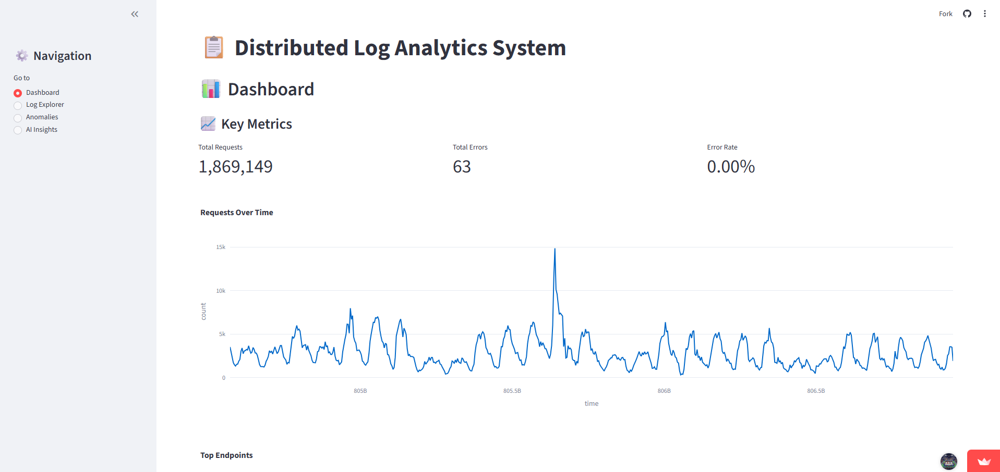

  

  

# Hi, I'm Kushagra Gupta

### AI/ML Engineer • Full Stack Developer • Computer Vision Enthusiast

B.Tech CSE (AI & ML) student at Manipal Institute of Technology with a strong interest in:
- Artificial Intelligence & Machine Learning
- Full Stack Development
- GenAI Engineer
- Computer Vision
- Distributed Systems
- Large Language Models (LLMs)

---

## About Me

- CGPA: **9.3/10**
- Achiever Scholarship Recipient (Top 5% at MIT Manipal)
- Solved **300+ LeetCode problems**
- Building AI-powered full-stack applications
- Interested in scalable ML systems, RAG pipelines, and backend engineering

---

## Tech Stack

### Languages
`Python` `Java` `C` `C++` `JavaScript` `SQL` `Go`

### AI / ML
`Machine Learning` `Deep Learning` `PyTorch` `TensorFlow` `Scikit-learn`
`Keras` `Computer Vision` `NLP` `RAG`
`LLMs` `CUDA` `NumPy` `Pandas`

### Backend / Web
`React` `Node.js` `Express.js`
`FastAPI` `Flask` `Django`
`REST APIs` `JWT Auth`
`HTML` `CSS`

### Big Data / Cloud
`AWS` `Google Cloud`
`Apache Spark`
`PySpark`
`Hadoop`
`Distributed Systems`
`ETL Pipelines`

### Databases
`MongoDB`
`PostgreSQL`
`SQLite`
`NoSQL`

### Tools
`Git` `Docker` `Kubernetes`
`Linux` `VS Code`
`IntelliJ`
`Streamlit`
`Colab`

---

# Featured Projects

## NextFlow – Visual AI Workflow Orchestrator
[GitHub](https://github.com/KushagraB424/NextFlow) | [GitLab](https://gitlab.com/kushagrab424-group/nextflow) | [Live Demo](https://nextflow-gamma-sable.vercel.app/)

  

Full-stack visual AI workflow orchestrator allowing users to dynamically construct and execute multi-step pipeline DAGs.

### Tech
Next.js 15 • React Flow • LLM • RAG • PostgreSQL • Gemini

### Highlights
- Drag-and-drop interactive canvas
- State management and real-time telemetry
- Event-driven backend execution
- Retrieval-Augmented Generation (RAG) pipeline

## Lantern – Agentic Business Intelligence Platform
[GitHub](https://github.com/KushagraB424/Lantern) | [GitLab](https://gitlab.com/kushagrab424-group/lantern) | [Live Demo](https://lantern-three-beta.vercel.app/)

  

Agentic Business Intelligence platform using LangGraph to transform datasets into insights.

### Tech
LangGraph • PostgreSQL • Python • Pandas • FastAPI

### Highlights
- Multi-agent workflow with human-in-the-loop approval
- State management and PostgreSQL checkpointing
- Secure Python execution sandbox for automated data analysis
- RAG and semantic memory using text embeddings

## TaskMates – Home Services Marketplace
[View Code](https://github.com/KushagraB424/TaskMate) | [Live Demo](https://taskmate-68tu.onrender.com/)

  

Containerized full-stack marketplace platform with AI-powered service discovery.

### Tech
Django • PostgreSQL • Docker • Gemini API

### Highlights
- Conversational AI chatbot
- Transaction-safe booking workflows
- RBAC implementation
- Dockerized deployment

---

## AI Research Assistant
[View Code](https://github.com/KushagraB424/Research_Assistant) | [Live Demo](https://research-assistant-frontend-2cm4.onrender.com/)

  

RAG-based research assistant that allows users to upload PDFs and perform context-aware semantic search and question answering.

### Tech
React • Node.js • MongoDB • Gemini Embeddings • RAG

### Highlights
- Semantic retrieval over 100+ page PDFs
- Chunked vector search pipeline
- Real-time query processing
- Sub-second response latency

---

## Fashion Vision AI – Multi-Object Fashion Segmentation & Agentic Shopping
[View Code](https://github.com/KushagraB424/visual-product-search) | [Live Demo](https://visual-product-search-idjp.onrender.com/)

  

AI-powered fashion understanding pipeline using object detection, segmentation, and LLM-powered recommendations.

### Tech
YOLOv8 • EfficientNet • PyTorch • FastAPI • OpenRouter

### Highlights
- Multi-object garment segmentation
- 15+ clothing categories
- Agentic shopping recommendations
- ~78% mAP validation performance

---

## SafePay – Secure Payment System
[View Code](https://github.com/Saksham-Gupta-GH/safepay) | [Live Demo](https://safepay-7cyg.onrender.com/)

  

Secure payment platform with fraud detection and encrypted transaction handling.

### Tech
Flask • MongoDB • AES-256 • Machine Learning

### Highlights
- ML-based fraud detection
- AES-256 encryption
- Concurrent transaction handling
- Role-based authentication

---
## LogInsight – Distributed Log Analysis System
[GitHub](https://github.com/KushagraB424/Log_Analyst) | [Live Demo](https://loganalyst-kushagra-gupta.streamlit.app/)

  

Distributed log analysis system using PySpark to process web server access logs with an interactive AI-powered dashboard.

### Tech
PySpark • Streamlit • Python • Plotly • Gemini API

### Highlights
- Distributed data processing pipeline using Apache Spark
- Interactive log explorer and visualization dashboard
- Statistical anomaly detection for server requests
- AI-powered log insights and summarization via Gemini

# GitHub Stats

  
  

---

# Achievements

- Achiever Scholarship Recipient (Top 5%)
- Finalist — MIT Open Coding Challenge
- 250+ LeetCode Problems Solved
- Google Cloud Digital Leader Certified

---

# Connect With Me

- LinkedIn: www.linkedin.com/in/kushagra-gupta-8861663a0/
- GitHub: github.com/KushagraB424
- Email: kushagrab424@gmail.com
- GitLab: https://gitlab.com/kushagrab424
- Leetcode: https://leetcode.com/u/KushagraB424/

---

Always open to collaborating on AI, ML, backend, and open-source projects.

  

